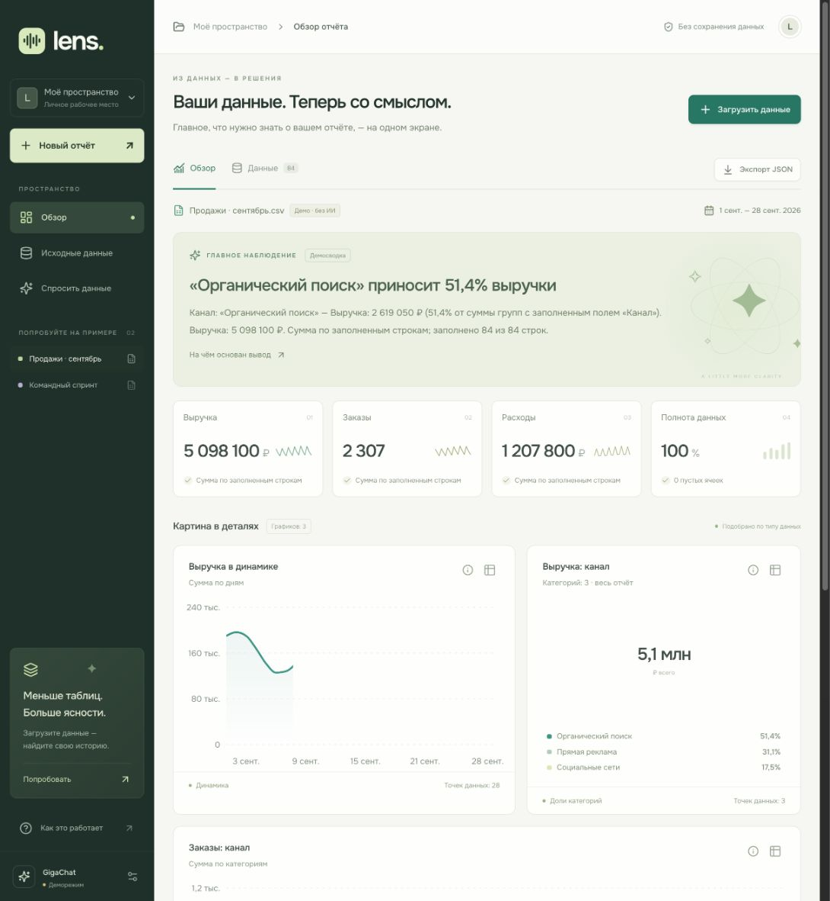

# Lens — ваши данные со смыслом

Микро-SaaS для анализа CSV, Excel и текстовых отчётов. Короткая история, интерактивные графики и чат с подтверждениями из источника. Без регистрации и базы данных.

[](https://github.com/skufdeveloper/lens-data-stories/actions/workflows/ci.yml)



## Запуск за минуту

Нужен **Node.js 24 LTS** (версия указана в `.nvmrc`).

```bash
npm ci
cp .env.example .env.local
npm run dev
```

Откройте [localhost:3000](http://localhost:3000). Без ключа приложение работает в **явно обозначенном деморежиме**: файлы действительно читаются, показатели рассчитываются, графики строятся; сводка и ограниченный набор ответов формируются правилами, без вызовов LLM.

## Подключение GigaChat

В `.env.local` задайте ключ авторизации из кабинета разработчика GigaChat:

```dotenv
GIGACHAT_CREDENTIALS=ваш_Authorization_Key
GIGACHAT_SCOPE=GIGACHAT_API_PERS
GIGACHAT_MODEL=GigaChat-2
GIGACHAT_BASE_URL=https://api.giga.chat/v1
```

`GIGACHAT_CREDENTIALS` — готовая base64-строка Authorization Key, а не обычный пароль. Для других типов аккаунта используйте соответствующий scope: `GIGACHAT_API_B2B` или `GIGACHAT_API_CORP`. Можно указать доступную вашему аккаунту модель `GigaChat-2-Pro` / `GigaChat-2-Max`.

Перезапустите сервер и загрузите файл. Для анализа уже открытого примера нажмите настройки GigaChat внизу бокового меню → «Проанализировать текущий отчёт с GigaChat».

Адаптер получает OAuth-токен на сервере, кэширует его до истечения срока, объединяет параллельные запросы токена и один раз повторяет запрос после 401. Структура результата задаётся `response_format: { type: "json_schema", schema, strict: true }` и дополнительно проверяется Zod.

Если среда не доверяет сертификатам сервиса, добавьте **официальный PEM-сертификат** в `GIGACHAT_CA_CERT` (поддерживаются реальные переносы строк и `\n`). Проверка TLS не отключается. Опциональный `GIGACHAT_ACCESS_TOKEN` предназначен для временного bearer-токена; он не обновляется автоматически.

Ключи никогда не используют префикс `NEXT_PUBLIC_`, не возвращаются браузеру и не коммитятся. `.env.local` исключён из Git. Исходные данные не записываются на диск приложения. В AI-режиме факты и выбранные строки передаются GigaChat.

Официальная документация: [авторизация](https://developers.sber.ru/docs/ru/gigachat/api/reference/rest/gigachat-api), [структурированные ответы](https://developers.sber.ru/docs/ru/gigachat/guides/structured-output), [сертификаты](https://developers.sber.ru/docs/ru/gigachat/certificates).

## Что работает

- Drag-and-drop и выбор CSV, TSV, XLSX, TXT; вставка текста; состояния обработки и восстановление после ошибок.
- Hero с главным наблюдением, источниками и явной маркировкой режима.
- Линейные, столбчатые и кольцевые графики: подсказки, таблица значений, объяснение выбора.
- GigaChat выбирает графики из допустимых вариантов; числа всегда вычисляет код.
- Чат выбирает подтверждённые факты и показывает их дословно. Если подтверждений нет: «В этом отчете нет такой информации».
- Исходная таблица с поиском и пагинацией, история отчётов в памяти вкладки, экспорт отчёта в JSON.
- Адаптивный интерфейс, клавиатурное управление диалогами, reduced motion, локальные шрифты.

Готовые файлы для проверки: [sales.csv](public/examples/sales.csv), [sales.xlsx](public/examples/sales.xlsx), [weekly-report.txt](public/examples/weekly-report.txt). Они содержат **синтетические демонстрационные данные**. CSV и XLSX воспроизводятся командой `node scripts/create-fixtures.mjs`.

## Как устроена AI-логика

```text
CSV / XLSX / текст
  → валидация и нормализация
  → типизация столбцов и детерминированные агрегаты
  → каталог фактов с идентификаторами + допустимые графики
  → GigaChat: сводка и выбор графиков
  → Zod + проверка ссылок на факты и чисел
  → UI

Вопрос
  → повторный расчёт фактов из исходных данных
  → поиск релевантных строк (до 40, до 20 000 символов)
  → GigaChat: answerable + evidenceIds
  → ответ из дословных подтверждений / отказ
```

Чат не доверяет присланным клиентом итоговым числам: сервер пересчитывает их. Выдуманный ID факта делает ответ неподтверждённым. Модель не может добавить в ответ чата произвольное число или свободный текст: ответ собирается на сервере из фактов. Релевантные строки — выборка, и промпт запрещает выводить из неё глобальные агрегаты.

Проверка чисел в свободной hero-сводке — дополнительный барьер, **не доказательство семантической корректности**. Ошибочный выбор подходящего по ID, но нерелевантного вопросу факта остаётся риском LLM. Поэтому источники доступны в интерфейсе, температура низкая, неизвестные вопросы должны приводить к отказу. Полноценный live-eval на реальной модели требует ключа.

Сбой настроенного GigaChat показывает ошибку с повтором. Демо не подменяет AI незаметно: пользователь может отдельно выбрать «Открыть без ИИ».

## Архитектура и стек

**Next.js 16 / React 19 / TypeScript**, Node.js Route Handlers для Vercel; **Recharts**, **Motion**, **Radix Dialog**, **Lucide**, **Zod**, **PapaParse**, **ExcelJS**. Стили — обычный CSS с переменными; Tailwind не нужен для этого объёма. Шрифт Onest поставляется локально.

```text
src/app/api/          анализ, чат, состояние настройки AI
src/components/      workspace, загрузка, графики, чат, исходные данные
src/lib/parse.ts      безопасное чтение и нормализация файлов
src/lib/profile.ts    вычисления, факты, кандидаты графиков
src/lib/retrieval.ts  ограниченный поиск по строкам
src/lib/server/      GigaChat, промпты, оркестрация, HTTP-ограничения
public/examples/     воспроизводимые демоданные
docs/                сценарий питча, журнал AI, проверка и delivery
```

Нет авторизации, БД, векторного хранилища и фоновых задач. Перезагрузка вкладки очищает пользовательские отчёты. Каждый вопрос независим от предыдущих; лимиты контекста прозрачны.

## Ограничения MVP

- До **2 МБ**, **1 000 строк**, **30 столбцов**; текст — до **16 000 символов**. Ячейка — до 2 000 символов. Числовые значения ограничены ±1 трлн.
- CSV в UTF-8: запятая, точка с запятой или табуляция. Даты — ISO `YYYY-MM-DD` или `DD.MM.YYYY`. Поддерживаются числа с пробелами, десятичной запятой и символами валют. Неоднозначное `1,234` трактуется как разделитель тысяч.
- Excel: первый непустой лист, заголовки в первой непустой строке; формулы не исполняются, читаются их сохранённые результаты. `.xls`, зашифрованные и повреждённые файлы отклоняются.
- Полностью числовой столбец классифицируется как число; произвольные `N/A` / текстовые значения делают столбец категориальным. Проценты/средние усредняются по заполненным строкам, без скрытого взвешивания; остальные показатели суммируются. ID не суммируются.
- Графики строятся, только когда есть осмысленная структура. Для текста числа извлекаются из явных строк `Название: число [единица]`; произвольная проза может дать менее двух графиков или ни одного. Числа не выдумываются ради трёх карточек.
- Даты для графика ограничены 60 уникальными значениями, категориальные группы — 12. В контекст чата передаются рассчитанные факты и ограниченная выборка подходящих строк; произвольные сложные SQL-подобные запросы не поддержаны.
- Локальный ограничитель запросов — 20/мин на экземпляр процесса, а не распределённый rate limit. Для публичной production-эксплуатации нужна дополнительная квота/WAF на платформе и лимит расходов GigaChat.
- Лимит распаковки Excel — 15 МБ. Данные не пишутся приложением в логи; политика провайдера GigaChat и инфраструктуры хостинга применяется отдельно.

## Проверки

```bash
npm test
npm run typecheck
npm run lint
npm run build
npm audit --omit=dev
```

Тесты покрывают парсинг CSV/XLSX, реальные Excel-формулы и даты, пропуски, средние процентов, временные ряды, запрет некорректных pie, источники ответов, отказы, поиск строк, лимит тела запроса и GigaChat OAuth/401/429/таймаут/невалидный JSON. Транспорт GigaChat подменён: **живой запрос без ключа не проверялся**. GitHub Actions запускает те же quality gates на Node.js 24.

В браузере вручную проверяются загрузка файла/текста, исходная таблица, чат и отказ вне отчёта, модальные окна, графики и мобильная ширина. Подробности: [проверка и delivery](docs/DELIVERY.md).

## Деплой на Vercel

Импортируйте репозиторий в Vercel как Next.js, выберите Node.js 24 и задайте переменные GigaChat из `.env.example`. Build command — `npm run build`; output directory оставьте по умолчанию. Не добавляйте API-ключ в build-команду или в Git.

```bash
npx vercel login
npx vercel --prod
```

Без ключа опубликованный сервис остаётся демонстрационным. `/api/health` показывает только факт наличия конфигурации, а не проверку работоспособности ключа. После подключения ключа выполните сценарий из [DELIVERY.md](docs/DELIVERY.md).

## Работа с ИИ и питч

- [Черновой видео-питч — 4 минуты 46 секунд](docs/lens-pitch-draft.mp4), реальные экраны + синтетическая озвучка, с явной пометкой деморежима. Запись не выдаётся за live-вызов GigaChat.
- [Журнал решений, реальные запросы и исправленные ошибки](docs/AI-WORKLOG.md).
- [Сценарий видео на 3–5 минут](docs/PITCH.md).
- Рабочие промпты: [prompts.ts](src/lib/server/prompts.ts).

Здесь нет выдуманных логов работы: тестовые ответы GigaChat явно обозначены как mock, а демосводка не выдаётся за результат живой модели.
